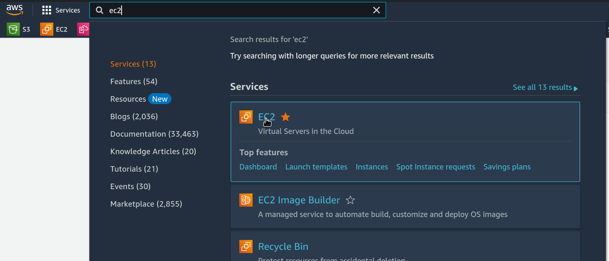
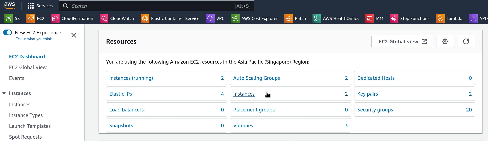
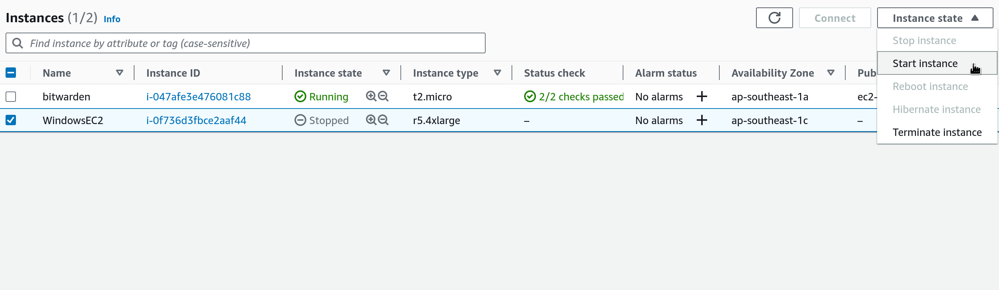

# Windows GUI applications

The following manual explains how to use a Windows computing instance in AWS. This is especially useful for running graphical user interface (GUI) applications.

## Pre-requisites
- RDP file provided and Windows instance passowrd provided by GeDaC
- An RDP client. Recent versions Windows have one built-in. For macOS, you can use [Microsoft Remote Desktop](https://apps.microsoft.com/store/detail/microsoft-remote-desktop/9WZDNCRFJ3PS?hl=en-sg&gl=sg&rtc=1), and for Linux you can use [Remmina](https://remmina.org/). Trying to open the .rdp file should open the RDP client. If it doesn't, you can open the RDP client and open the .rdp file from there.

## Before connecting to the instance
AWS will charge you for the time the instance is running. Therefore, you should only connect to the instance when you need to use it. When you are done, you should stop the instance. This will stop the charges. You can start the instance again when you need to use it again. Given that the instances created have significant resources, it is **very important** that you stop the instance when you are not using it.  

## Starting the instance

1. Go to the [AWS console](https://console.aws.amazon.com) and sign in with IAM credentials (either email and password for root accounts, or Account ID, username, and password for IAM users).
2. In the search bar, type "EC2" and select the EC2 service.  
  

3. In the EC2 dashboard, click on "Instances" in the left menu.  
  

4. Select the checkbox at the left of the instance called "WindowsEC2", and click on "Instance State" and then "Start Instance". It would take a minute or so to start the instance. When you see "Running" in the column "Instance state", the instance is ready to be used.
  

## Stopping the instance
Follow steps 1 to 4 above. Instead of clicking "Instance State - Start instance" click on "Instance State" and then "Stop Instance". This will stop the instance and stop the charges.

## Connecting to the instance

1. Open the .rdp file provided by GeDaC. This should open the RDP client.
2. Enter the password provided by GeDaC.
3. Click on "Connect" and wait for the connection to be established.
4. You should now see the Windows desktop. You can now use the instance as if it was a regular Windows computer.

## Inside the instance

Once your RDP client connects to the instance, you will see an entire Windows desktop. There you can install the applications that you require. For your convenience, AWS cli has been already installed with your credentials, and can be used to interact with AWS services, like S3.

### Note on storage in the instance

By default, the Windows instance is created with 500GB of storage. It is recommended to keep important files in S3. The procedure that we recommend follows.

1. Download the files needed for an analysis from S3 to the Windows instance.
2. Perform the analysis.
3. Upload the results to S3.
4. Delete the files from the Windows instance.
5. Stop the instance.